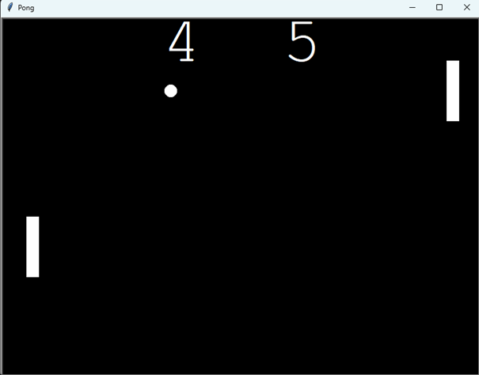

# Pongo
A simple Pong game created as part of Udemy's 100 Day of Code: Pyhon Bootcamp by Dr. Angela Yu.

## Features
- 2-player local game
- Independent paddle controls
- Scoreboard
- First player to reach 10 points wins

## Controls
how to play:
```
Player 1 (Left)  - W and S
Player 2 (Right) - Arrow Keys
H                - End the game
```

## Screenshot 
Include a screenshot of the game window:
<p align="center">
  
</p>

## Requirements
```
- Python 3.x
- turtle (standard in Python)
```

## Installation 
Clone the repository:
```
git clone https://github.com/Lukajekul/Pong_-_Udemy_Course_Practice.git
cd Pong_-_Udemy_Course_Practice
```

## Usage
Run the game in your terminal:
```
python Pong_-_Udemy_Course_Practice.py
```
The game will start immediately.

## Credits
Built during the "100 Days of Code: The Complete Python Pro Bootcamp" on Udemy by Dr. Angela Yu.

## License

This project is licensed under the MIT License.  
See the [LICENSE](LICENSE) file for details.
